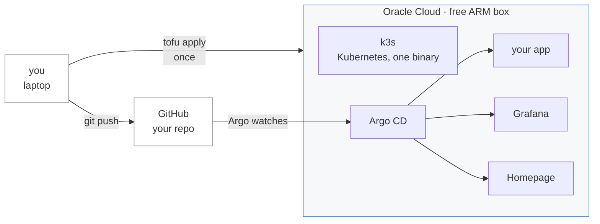
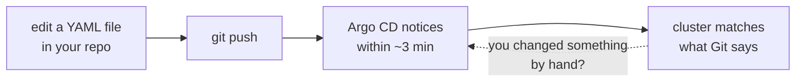

# oci-k3s-starter

**A free ARM server running your container, with deploys and monitoring already wired.**

Oracle Cloud gives away an Arm box — 4 cores and 24 GB of RAM — for nothing, permanently.
This turns it into a small personal platform: `k3s` for the runtime, **Argo CD** so a
`git push` is the deploy button, **Grafana** so you can see what your app is doing, and
**Homepage** so you have one URL that lists everything.

One `tofu apply`. No Kubernetes knowledge required to get to the first running app.

```bash
oci session authenticate          # browser login, no keys on disk
cd terraform
cp terraform.tfvars.example terraform.tfvars   # fill in 3 values
tofu init && tofu apply

cd .. && ./scripts/connect.sh     # opens every dashboard  (connect.ps1 on Windows)
```

**Works on macOS, Linux and Windows.** Every command that differs between them is given in
both forms; Windows needs PowerShell, not WSL, though WSL is fine if you have it.

---

## What you get



| | |
|---|---|
| **k3s** | single-node Kubernetes, the light kind — the whole control plane is one binary |
| **Argo CD** | points at a Git repo and keeps the cluster matching it |
| **Grafana + VictoriaMetrics** | metrics for the node, the cluster and your app |
| **Homepage** | one dashboard linking the above |
| **Serial console** | a way back in when you break networking, which you will |

Everything is declared here. If the box is lost, `tofu apply` builds it again.

**You do not need to know Kubernetes to use this.** You need to know how to write a
Dockerfile and push to Git. The deploy loop is:



That last arrow is the useful part: Argo puts things back. There is no deploy command to
run and no server to log into.

---

## Climb only as far as you need

The repo is built as four rungs. **Each one works on its own** — stop whenever you have
what you came for.

### Rung 1 — a box running your container
*Needs: an Oracle Cloud account. That's it.*

`tofu apply` gives you the server, k3s, Argo CD, Grafana and Homepage, with a sample app
already deployed from a public repo. **No domain, no DNS, no credentials to create.**
You reach it with `kubectl port-forward`.

This rung is deliberately credential-free, so nothing can go wrong before you have seen it
work.

→ [docs/rung-1-the-box.md](docs/rung-1-the-box.md)

### Rung 2 — real URLs instead of port-forward
*Needs: a domain — about $10/year. The only thing in this repo that costs money.*

Adds a Cloudflare Tunnel, so `grafana.yourdomain.com` works from anywhere — **without
opening a single inbound port** — and Cloudflare Access puts a login in front of it.

Skip this rung entirely if you do not own a domain. Everything above keeps working.

→ [docs/rung-2-real-urls.md](docs/rung-2-real-urls.md)

### Rung 3 — deploy *your* app
*Needs: a Git repo with your manifests.*

Point Argo CD at your own repository. Public repo: nothing to configure. Private repo:
this is where a **GitHub App** or a personal access token comes in, and the doc explains
which to pick and why.

→ [docs/rung-3-your-app.md](docs/rung-3-your-app.md)

### Rung 4 — secrets without secrets on disk
*Needs: nothing extra — it is already in your Oracle account.*

**OCI Vault** plus External Secrets. The box authenticates *by being that instance* — an
instance principal — so there is no API key on the server to steal or rotate.

→ [docs/rung-4-secrets.md](docs/rung-4-secrets.md)

---

## What you actually need

**Required**

- An **Oracle Cloud account** — the Always Free tier, no card charged
- **[OpenTofu](https://opentofu.org)** (or Terraform)
- The **[OCI CLI](https://docs.oracle.com/en-us/iaas/Content/API/SDKDocs/cliinstall.htm)**, for the browser login

**Recommended, not required**

- **Cloudflare** + a domain — **the one thing here that costs money** (~$10/year for the
  domain; the Cloudflare plan itself is free). Strongly recommended anyway: it is what
  gives you a valid HTTPS certificate, a login in front of everything, and no open ports.
  Everything still works without it — rung 1 needs none of it. See
  [rung 2](docs/rung-2-real-urls.md) for why it is worth ten dollars.
- **Tailscale** — a private path to the box that survives you breaking the public one.
- **healthchecks.io** / **ntfy** — free, for "tell me when it dies" and "tell my phone".

## Login: a browser, not a key file

Most Oracle guides have you generate an RSA key, upload the public half, copy a
fingerprint, and leave a `.pem` in `~/.oci` forever. This repo defaults to the other way:

```bash
oci session authenticate      # opens a browser
oci session refresh           # when it expires
```

```hcl
provider "oci" {
  auth                = "SecurityToken"
  config_file_profile = "my-profile"
}
```

A session expires. A key file on your laptop does not — it sits there until it leaks. The
browser flow is both the safer option **and** the shorter one, which is rare enough to be
worth choosing deliberately.

API-key auth is still supported, and documented for CI, where no browser exists.

## Cost, and the one date that matters

Always Free is genuinely free — but Oracle's ARM allowance **drops to 2 cores / 12 GB**
for accounts created after their trial ends, and **exceeding the allowance deletes every
ARM instance in your tenancy after 30 days — not just the excess.**

The default here is sized to fit inside the smaller allowance on purpose. See
[docs/cost-and-limits.md](docs/cost-and-limits.md) for what the stack itself consumes and
how much is left for your app — the answer is roughly half, and knowing that up front is
better than learning it from an OOMKill.

## Keeping it current

Version pins go stale, and a starter repo that installs last year's everything is worse
than no starter repo. [Renovate](https://github.com/apps/renovate) is configured here to
open pull requests for the chart, image, provider and Argo CD pins.

> ⚠ **The config does nothing until the App is installed on the repo.** A `renovate.json5`
> with no Renovate behind it opens zero PRs, silently and forever — and looks exactly like
> a Renovate with nothing to do. Treat *"when did the bot last open a PR?"* as a health
> signal.

## Where this came from

Extracted from a working two-site homelab where this box is the off-site half — it watches
the house from outside, because a machine cannot observe its own outage. The watching parts
are not in here; what is left is the useful skeleton underneath them.

## Licence

MIT — see [LICENSE](LICENSE).
