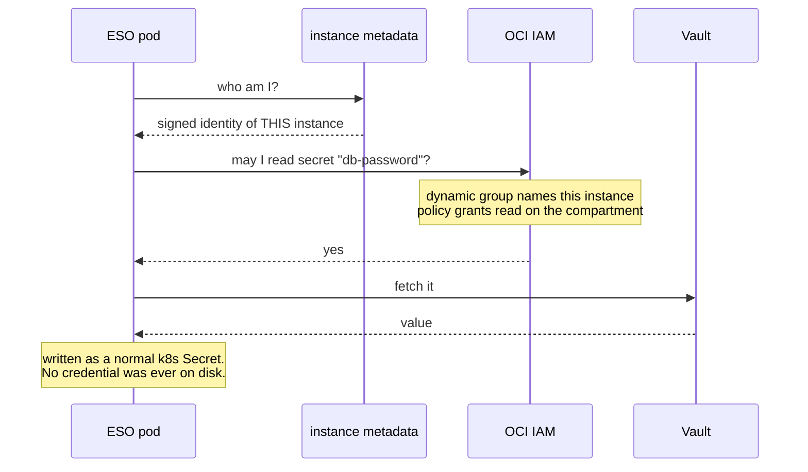

# Rung 4 — secrets without secrets on disk

**You need:** nothing extra. OCI Vault is already in your account, and a `DEFAULT` vault
with software keys is free.

---

## The problem with every other option

Your app needs a database password. The usual answers:

- **A Secret in the cluster** — fine, until you want it in Git. And base64 is not encryption.
- **Encrypted in Git** (SOPS, sealed-secrets) — better, but now there is a *decryption key*,
  and it has to live on the box. You moved the problem.
- **A cloud secret manager** — better still, but the box needs an API credential to talk to
  it. You moved the problem again.

Every one of them ends with **a credential on the machine** that unlocks the rest. On a box
with a public IP, that is the thing you least want to have.

## What OCI gives you instead

**Instance principal.** The box authenticates *by being that instance* — Oracle already
knows which VM is asking. No key, no token, no file. Nothing to rotate, and nothing to
steal from the disk.



Take the disk and you get nothing: the credential was never on it.

## Turn it on

```hcl
# terraform.tfvars
enable_vault = true
tenancy_ocid = "ocid1.tenancy.oc1..aaaa..."
```

```bash
tofu apply
```

> ⚠ **`tenancy_ocid` is required, and it is not the same as `compartment_ocid`.** Dynamic
> groups and policies are tenancy-level objects — they cannot be created anywhere else. It
> also means this step needs an account allowed to write IAM at the tenancy. As the account
> owner you are; a restricted user may not be, and the failure is a 404 on the policy rather
> than a clear "you are not allowed to".

That creates four things: a vault, a key, a **dynamic group naming exactly this instance**,
and a policy letting that group read secrets in your compartment.

## Deploy the operator, then the store

Order matters — the CRDs must exist before the store, and the store before any
`ExternalSecret` that uses it.

```bash
cp kubernetes/optional/app-external-secrets.yaml kubernetes/applications/
git commit -am "add external secrets" && git push
# wait for Argo to report Healthy, then:
tofu output -raw clustersecretstore_manifest | kubectl apply -f -
```

The manifest is generated with your vault OCID and region already in it, so there is
nothing to paste.

## Using it

Put a secret in the vault (console → Identity & Security → Vault → Secrets, or the CLI),
then reference it **by name**:

```yaml
apiVersion: external-secrets.io/v1
kind: ExternalSecret
metadata:
  name: db-password
  namespace: my-app
spec:
  refreshInterval: 1h
  secretStoreRef:
    name: oci-vault
    kind: ClusterSecretStore
  target:
    name: db-password          # the Kubernetes Secret this creates
  data:
    - secretKey: password      # the key inside that Secret
      remoteRef:
        key: my-app-db-password   # the NAME of the vault entry
```

**Note what is in Git: a name, never a value.** That file is safe in a public repo. The
value is fetched at runtime by a machine that proved its own identity.

Your Deployment then uses it like any other Secret:

```yaml
env:
  - name: DB_PASSWORD
    valueFrom:
      secretKeyRef:
        name: db-password
        key: password
```

## What rungs 2 and 4 do together

If Cloudflare is also enabled, Terraform writes the **tunnel token straight into the
vault** — so the manual "pipe this into kubectl" step from rung 2 disappears, and a rebuilt
box fetches its own connector credential by being itself.

That is the whole argument for this rung in one resource: the credential exists, but never
on a laptop, never in a shell, and never on the instance's disk.

## Deliberate limits

- **Read-only.** The policy grants `read secret-family` — listing and reading. The box
  consumes secrets; it does not manage them. Writing stays a human action.
- **One instance, named.** The dynamic group matches `instance.id = '<this box>'`, not
  "every instance in the compartment". A second box has to be granted deliberately instead
  of inheriting this one's access on the day you create it.
- **No `use keys` grant.** Decryption happens inside the Vault service, so the instance
  never touches the key. (If a read ever 403s, that is the first assumption to re-check.)
- **Free tier.** `DEFAULT` vault, `SOFTWARE` keys, 150 secrets. `VIRTUAL_PRIVATE` vaults
  and HSM keys are billed — and a vault's type **cannot be downgraded** once created.

## Why not SOPS

The homelab this came from uses SOPS with an age key, and deliberately does **not** on this
box — an age key able to decrypt everything has no business on the only internet-facing
machine you own. Instance principal has no equivalent key to leak, and on a box with a
public IP that difference is the entire argument.
